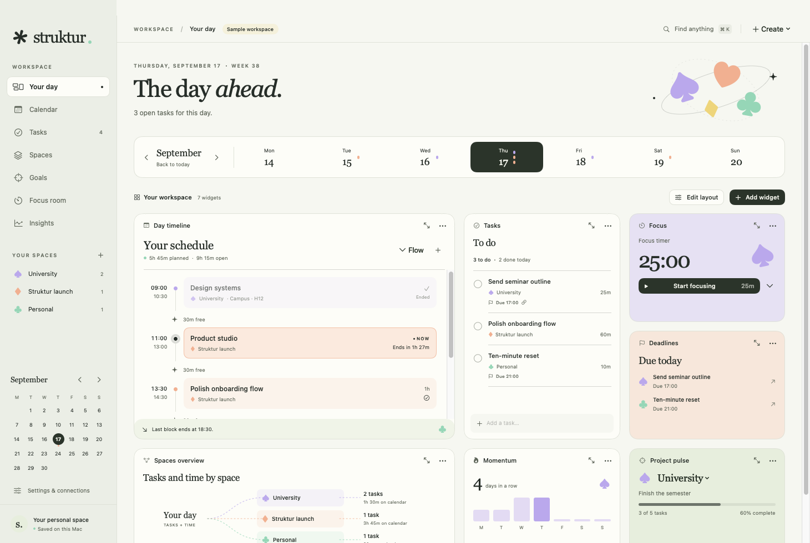

# Struktur

Your day, by design. An Apple-native workspace for time, tasks, spaces, and a little breathing room.

Built in Swift 6 and SwiftUI for macOS 15+. No web view, account, analytics, or third-party dependencies.

[Dark mode preview](Documentation/preview-dark.png)

## Run

Requires a Swift 6.2+ toolchain (Xcode 26+). Development has been verified with the installed Swift 6.4 toolchain.

~~~sh
swift run Struktur
~~~

Build the local macOS application:

~~~sh
./scripts/build-app.sh
open dist/Struktur.app
~~~

The packaging script generates the icon, embeds the privacy manifest, and verifies an ad-hoc signature. Previous app builds are preserved in `dist`. Set `STRUKTUR_UNIVERSAL=1` to build both Apple Silicon and Intel slices. Public distribution requires your Apple Developer identity and approval; see [distribution instructions](Documentation/Distribution.md).

## Your workspace

- Eleven widget types: day timeline, tasks, focus, deadlines, connections, momentum, daily progress, upcoming events, project goals, Markdown notes, and custom goal tracking.
- **Edit layout** enables dragging by a widget's header and resizing by its bottom-right corner. The widget menu also offers exact sizes, move earlier/later, removal, and space filters for supported modules.
- Add multiple instances of a widget and pin each to a different space. Layout, size, order, appearance, and calendar preferences save automatically.
- Every widget can open in a larger view. Calendar, tasks, spaces, goals, focus, and insights also have dedicated pages.
- The starter workspace is labeled as sample content. Keep the examples or start empty in Settings → General.
- The original default dashboard upgrades to the new starter layout. Custom legacy widget selections and calendar/appearance settings are retained.

## Time, with context

The flow timeline shows actual start and end times, live countdowns, open gaps, and the final block of the day. Scheduled tasks occupy their estimated duration. A deadline is displayed as a due marker, not an invented calendar appointment.

The calendar supports day, week, month, and agenda views; custom working hours; Sunday/Monday weeks; and optional weekends. Overlapping blocks get separate lanes, and multi-day/all-day events retain their date boundaries. Double-click an open timeline slot to create a block. Drag a task from the task list onto the calendar to schedule it. Month cells offer an add-block context menu.

Spaces carry a pastel color and a heart, diamond, spade, or club symbol across the app. Link tasks to specific calendar blocks, track a space's goal, inspect the relationship map, and copy stable `struktur://task/UUID`, `struktur://event/UUID`, or `struktur://space/UUID` references. Global search accepts titles, notes, and identifiers.

Calendar blocks can repeat daily, weekly on selected weekdays, or monthly, with an interval, end date, occurrence count, or no end. Rules retain their time zone and wall-clock time across daylight-saving changes. Edit/delete a single occurrence or the entire series; individually edited exceptions are retained when changing a series. Stable occurrence IDs resolve without storing every future block.

The Goals page supports daily, weekly, and ongoing targets for completed tasks or recorded focus minutes. Select individual task IDs or whole spaces, including future occurrences of recurring tasks. Pin different goals to separate dashboard widgets. Expanded goal widgets expose their connected tasks. Copy `struktur://goal/UUID` references; global search also accepts full references and occurrence IDs.

## Tasks, notes, and focus

Tasks support deadlines, scheduled starts, estimated durations, priorities, daily/weekly recurrence, and open-ended work. Completing a recurring task generates a future occurrence without hiding overdue work.

Markdown renders beside the editor as you type. Headings, inline formatting, links, lists, quotes, and interactive checkboxes are supported. The scratchpad saves automatically, including when the app quits.

The focus timer is shared across the dashboard and focus room. Pause, resume, and end sessions; associate a task; and inspect recorded focus time. Active and paused sessions survive relaunch. Finishing a timer records the session; marking its task complete is a separate action.

## Data and Apple apps

Your workspace is stored atomically under the app's Application Support directory as `Struktur/workspace.json`. A sandboxed app uses its container's Application Support directory; `swift run` uses the unsandboxed directory.

Settings → Data supports full-workspace and individual-space JSON exports. Imports replace the workspace after validation and preserve a separate backup of the previous file. The first save upgrading an older workspace to schema 3 also preserves an original `workspace-before-v3-…` backup. Goals and repeat rules are included in eligible exports. An unreadable workspace is never silently overwritten.

Settings → Apple offers optional manual exchange with Apple Calendar and Reminders. Export calendar blocks in a chosen range (up to one year per exchange) and open tasks from all spaces or a selected space. Repeating blocks export as individual occurrences within that range; import calendar events from the previous 30 and next 90 days, or import reminders. Identifiers prevent duplicate imports, including recurring calendar occurrences. Successful partial exports are recorded immediately so a later permission or save failure does not cause those items to be exported twice.

This connection adds new items and preserves existing ones. It is **not automatic two-way sync**: edits and deletions are not propagated. macOS permission and an available writable calendar/list are required. No Calendar or Reminders data is read merely by opening Struktur.

## Shortcuts

| Shortcut | Action |
| --- | --- |
| `⌘N` | New task |
| `⇧⌘N` | New calendar block |
| `⌘K` | Search tasks, events, spaces, and identifiers |
| `⌘T` | Today |
| Return / Escape | Save / cancel an editor |

## Verification

~~~sh
swift test
~~~

53 tests cover workspace migration, widget persistence and packing, recurring tasks and calendar series, linked goals, focus pause/resume/relaunch, schedule overlap and free-time calculation, all-day boundaries, references, scoped exports, import validation/backups, Apple exchange with a fake client, and Markdown checkboxes.

Debug builds support isolated previews that never touch your personal workspace:

~~~sh
STRUKTUR_PREVIEW=1 STRUKTUR_SNAPSHOT=/tmp/struktur.png .build/debug/Struktur
STRUKTUR_PREVIEW=1 STRUKTUR_THEME=dark STRUKTUR_WIDTH=1040 STRUKTUR_HEIGHT=740 \
  STRUKTUR_SNAPSHOT=/tmp/struktur-dark.png .build/debug/Struktur
~~~

`STRUKTUR_SECTION=calendar` (or `tasks`, `projects`, `goals`, `focus`, `insights`, `settings`) opens a specific page. `scripts/ui-check.swift` can inspect or exercise an explicitly selected preview PID through macOS Accessibility for native smoke checks.

`STRUKTUR_PREVIEW_FIXTURE=completion` adds recurrence/goal examples. Reuse a printed temporary workspace with `STRUKTUR_PREVIEW_ID=<its identifier>` for relaunch checks. The UI helper supports scrolling and debug-only native mouse-event replay (`replay-drag` / `replay-resize`).

Live Apple testing requires explicit consent: `scripts/apple-qa.sh --allow-disposable-apple-data` builds a separate QA app, requests permissions, creates disposable test containers, verifies round trips, and removes only its own containers. Do not run it without approval. See [verification details and release gates](Documentation/Verification.md).
