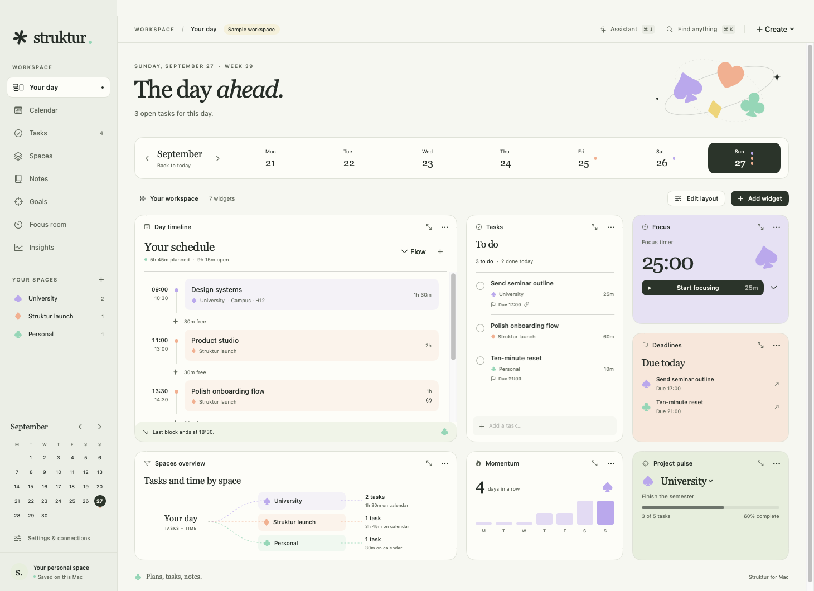
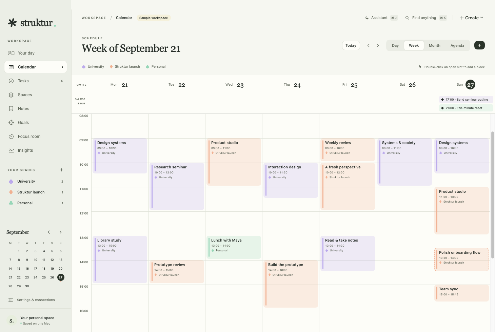
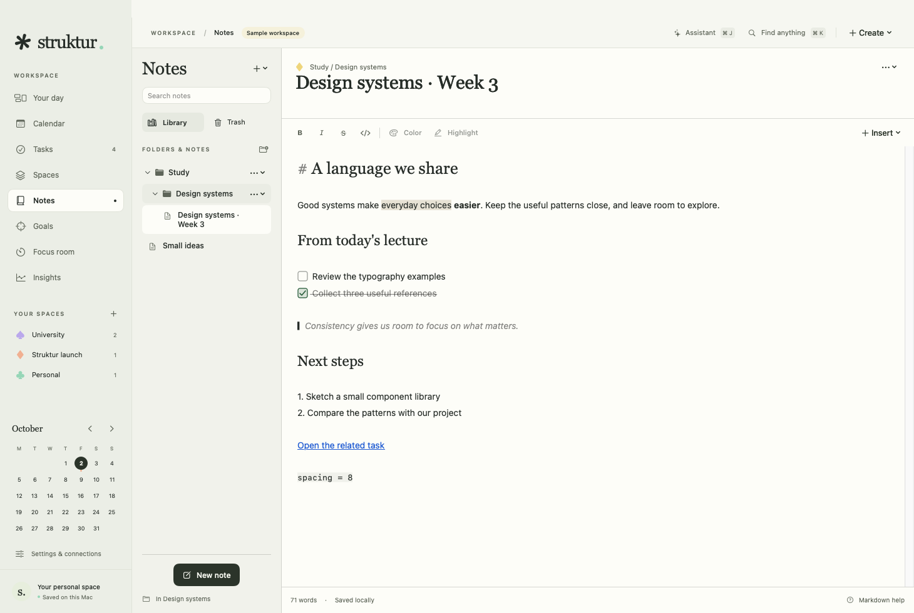
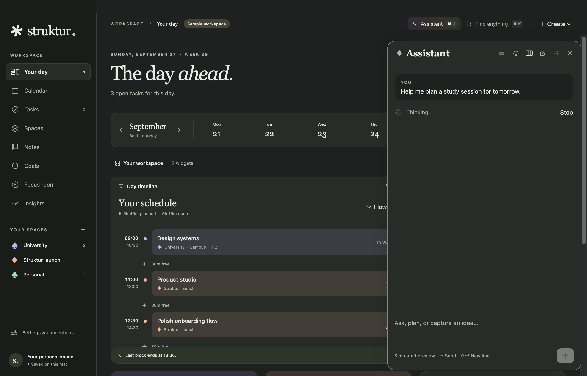

# Struktur

Your schedule, tasks, and notes, together on your Mac.

Struktur is a native macOS organizer for studying, project work, and everything around it. See what's planned, keep deadlines separate from time set aside to work, and find a place for the ideas you want to come back to.



Built with SwiftUI and AppKit. macOS 15+. No third-party dependencies or analytics.

[Build & run](#build--run) · [User guide](Documentation/Guide.md) · [Assistant](Documentation/Assistant.md) · [Development](Documentation/Development.md)

## Make room for your day

The dashboard brings your schedule, tasks, focus timer, and deadlines into one view. Choose from eleven widgets, move and resize them, or give each one a different space filter. Your layout stays the way you left it.

Spaces keep coursework, projects, and personal plans together. Each has its own color and suit symbol, carried through tasks, calendar blocks, and goals.

## See where your time goes

A deadline tells you when something is due. A calendar block tells you when you'll work on it. Struktur keeps both visible, with start and end times, overlaps, and the gaps between commitments.



Switch between day, week, month, and agenda views. Drag a task onto the calendar to schedule it, repeat a class or meeting, and link a task to the block it belongs to.

## Keep your notes close

Organize notes in folders, pin the ones you use often, and search across the library. Write in Markdown, add images and highlights, or switch to Preview for a clean reading view. Links can connect a note directly to a task, event, space, or goal.



Notes autosave locally and export to Markdown or PDF. In the Focus room, a timer and working notepad sit together; each saved session keeps its own copy of the notes.

## A hand when you need one

Open **Assistant** with **⌘J** to get a day brief, work through a note, or draft tasks and calendar blocks. Review and edit proposed items before adding them. Drag the header to place the panel on the left, in the middle, or on the right. While it thinks, a fine border slowly shifts between soft lilac, peach, and mint.



Apple's on-device model is the default on compatible Macs running macOS 26 or later. OpenAI is optional and uses your own API key. The app never switches to the cloud automatically. [Setup, privacy, and limits →](Documentation/Assistant.md)

Choose light, dark, or system appearance in Settings. These screenshots use the sample workspace; the Assistant response is simulated.

## Your data

The workspace lives on your Mac. Export a full JSON backup or a single space from Settings → Data. Imports are validated and keep a backup of the previous workspace.

Apple Calendar and Reminders are optional **manual import/export** connections. They add new items; they do not automatically synchronize edits or deletions. Opening Struktur does not read those apps. [Data and connections →](Documentation/Guide.md#data-and-apple-apps)

## Build & run

You'll need Swift 6.2+ and the macOS 26.4 SDK or later. The app itself targets macOS 15; the on-device Assistant requires compatible Apple Intelligence hardware and an available model.

```sh
swift run Struktur
```

To build a local app bundle:

```sh
./scripts/build-app.sh
open dist/Struktur.app
```

The bundle is locally ad-hoc signed. Public distribution still needs developer signing and release approval. See [distribution instructions](Documentation/Distribution.md).

## Useful shortcuts

| Shortcut | Action |
| --- | --- |
| ⌘N | New task |
| ⇧⌘N | New calendar block |
| ⌥⌘N | New note |
| ⌘K | Search the workspace |
| ⌘T | Go to today |
| ⌘J | Open or close Assistant |
| Return / ⇧Return | Send an Assistant message / start a new line |

## Development status

Run `swift test` for the regression suite. [Development notes](Documentation/Development.md) cover isolated previews, screenshot capture, and native UI checks. [Verification](Documentation/Verification.md) records what's been tested and what remains: consented live Apple exchange tests, broader hardware and VoiceOver checks, and public release signing.
